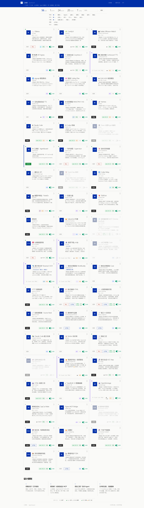

# Agentboard · 工具架

> 放一个 manifest.json，多一个可控工具。给人看状态，给 AI 调 API。

Agentboard 是一个本地工具控制面板。把工具注册为 `manifest.json` 放进目录，仪表盘自动发现、检测端口状态、一键启停。同一套注册信息同时服务人和 AI agent（Claude Code 等）。



## 双平面架构

| 平面 | 协议 | 入口 | 消费者 |
|------|------|------|--------|
| 管理面 | REST HTTP | `http://localhost:3099` | 人（Web 仪表盘） |
| 工具面 | MCP JSON-RPC stdio | `mcp-server.js` | AI agent（Claude Code, Cursor 等） |

两平面共享同一真相源：`tools/{id}/manifest.json`。改一处，两面自动生效。

## 一指令部署

```bash
# 1. 克隆
git clone https://github.com/wampeeHuang/agentboard.git ~/.agentboard
cd ~/.agentboard

# 2. 安装依赖（只依赖 express）
npm install

# 3. 启动
npm start
# → 浏览器打开 http://localhost:3099
```

**前提**：Node.js 18+，操作系统自带的 `netstat`（Windows）/ `lsof`（macOS）/ `ss`（Linux）可用。

Windows 用户把 `~/.agentboard` 换成 `%USERPROFILE%\.agentboard`，或在 PowerShell 中 `git clone` 到 `$env:USERPROFILE\.agentboard`。

## 注册工具

在 `tools/` 下建目录，放一个 `manifest.json`：

```
~/.agentboard/tools/
└── my-server/
    └── manifest.json
```

```json
{
  "name": "我的服务",
  "description": "【用途】一个示例 HTTP 服务。【何时用】需要测试时。【返回】{ok: true}",
  "capability": "示例HTTP服务",
  "owner": "自建",
  "icon": "🚀",
  "version": "1.0.0",
  "category": "设施",
  "order": 10,
  "port": 3456,
  "url": "http://localhost:3456",
  "projectPath": "/home/me/my-project",
  "startCommand": "cd /home/me/my-project && python server.py",
  "stopCommand": "npx kill-port 3456"
}
```

刷新仪表盘，卡片出现。端口状态来自 OS 级 `netstat`/`lsof`/`ss`，不靠 HTTP ping，不会误判。

### 必填字段

| 字段 | 说明 |
|------|------|
| `name` | 显示名称 |
| `description` | 描述，建议含【用途】【何时用】【何时不用】【返回】四段 |
| `capability` | 一句话任务描述（≤30字），AI 用来判断该调哪个工具 |
| `owner` | 所有者：`自建` / `外部` / `AI托管` |

### 完整字段

| 字段 | 类型 | 说明 |
|------|------|------|
| `name` | string | 显示名称。id 自动取目录名 |
| `description` | string | 工具描述 |
| `capability` | string | 一句话任务描述（≤30字） |
| `owner` | string | 自建 / 外部 / AI托管 |
| `icon` | string | emoji 图标 |
| `version` | string | 版本号 |
| `category` | string | 分类（模型/Agent/设施/获取/查阅/创作/职能） |
| `order` | number | 排序权重（越小越靠前） |
| `port` | number | 主端口 |
| `ports` | number[] | 多端口（和 port 二选一） |
| `url` | string | 运行时 URL |
| `projectPath` | string | 项目工作目录（startCommand 在此执行） |
| `startCommand` | string | 启动命令 |
| `stopCommand` | string | 停止命令 |
| `type` | string | service / cli / folder / group |
| `conflicts` | string[] | 互斥工具 ID（如 GPU 显存冲突） |
| `agent_notes` | string | 给 AI 看的踩坑笔记 |
| `trigger` | string | 触发命令（script 类型） |
| `children` | string[] | 子工具 ID（group 类型） |
| `publicUrl` | string | 公网地址 |
| `dashboard` | object | 内嵌仪表盘配置 |
| `disabled` | boolean | 停用工具（true 时卡片半透明，不参与启动/冲突检测） |

### 虚拟工具

只填 `name`、`url`、`owner`、`capability`、`description`，不填 `port` 和 `startCommand` → 纯链接卡片，点开即跳转。

### Manifest 改完需要重启吗？

不需要。每次请求自动扫描 `tools/` 目录。

## 接入 Claude Code（MCP）

在 Claude Code 设置中加入 MCP 配置，AI 就能通过标准协议发现和操控工具。

**Claude Code**（`~/.claude/settings.json`）：

```json
{
  "mcpServers": {
    "agentboard": {
      "command": "node",
      "args": ["~/.agentboard/mcp-server.js"]
    }
  }
}
```

**Claude Desktop**（`%APPDATA%\Claude\claude_desktop_config.json`）：

```json
{
  "mcpServers": {
    "agentboard": {
      "command": "node",
      "args": ["C:\\Users\\你的用户名\\.agentboard\\mcp-server.js"]
    }
  }
}
```

重启后可用四个 MCP 工具：

| MCP 工具 | 功能 |
|------|------|
| `agentboard_list_tools` | 列出所有工具及运行状态 |
| `agentboard_get_tool` | 获取单个工具详情（含 conflicts、agent_notes） |
| `agentboard_start_tool` | 启动工具（自动检测端口冲突） |
| `agentboard_stop_tool` | 停止工具 |

AI 调工具前会先查 `conflicts`（互斥检测）和 `agent_notes`（踩坑笔记），避免已知错误。

## API

所有操作都是 HTTP 调用，AI 和脚本都能直接消费。

Base: `http://localhost:3099`

### 工具管理

| 方法 | 路径 | 说明 |
|------|------|------|
| GET | `/api` | API 发现文档（返回所有端点和 manifest schema） |
| GET | `/api/tools` | 列出所有工具 + 实时运行状态 |
| GET | `/api/tools/:id` | 单个工具详情 |
| POST | `/api/tools/start/:id` | 启动工具 |
| POST | `/api/tools/stop/:id` | 停止工具 |
| POST | `/api/tools` | 创建工具 `{id, name, port, ...}` |
| PUT | `/api/tools/:id` | 更新工具 |
| POST | `/api/tools/reorder` | 排序 `{items: [{id, order}]}` |
| DELETE | `/api/tools/:id` | 删除工具 `?confirm=true`（删整个 tools/{id}/ 目录，不可逆） |

### 巡检与状态

| 方法 | 路径 | 说明 |
|------|------|------|
| GET | `/api/health` | 健康报告（崩溃数、异常退出、uptime） |
| GET | `/api/audit` | Schema 合规巡检（缺失字段、格式错误） |
| GET | `/api/audit/runtime` | 运行时漂移检测（路径不存在、端口未监听） |
| GET | `/api/stats` | API 调用统计（按调用方/操作/工具三维度） |
| GET | `/api/loop/health` | 联邦巡检 — 跨项目健康状态扫描 |

### 文件操作

| 方法 | 路径 | 说明 |
|------|------|------|
| GET | `/api/open-folder` | 在文件管理器打开目录 `?path=<绝对路径>` |
| GET | `/open-dir/:name` | 打开技能目录（如 `/open-dir/perspective-router`） |

### 技能图表

| 方法 | 路径 | 说明 |
|------|------|------|
| GET | `/skills` | 技能系统图表画廊 |
| GET | `/skills/:name` | 单个图表 HTML |

### Agent 调用示例

```bash
# 发现所有 API
curl http://localhost:3099/api

# 列出所有工具
curl http://localhost:3099/api/tools

# 启动
curl -X POST http://localhost:3099/api/tools/start/my-server

# 停止
curl -X POST http://localhost:3099/api/tools/stop/my-server

# 验证启动成功（等端口上线）
curl http://localhost:3099/api/tools | grep '"running":true'
```

## 环境变量

| 变量 | 默认值 | 说明 |
|------|--------|------|
| `PORT` | `3099` | 仪表盘端口（被占用则失败，不 fallback） |
| `AGENTBOARD_HOME` | `~/.agentboard` | 数据根目录 |
| `AGENTBOARD_TOOLS_DIR` | `~/.agentboard/tools` | 工具 manifest 扫描目录 |
| `AGENTBOARD_SKILLS_DIR` | `~/.claude/skills` | 技能图表扫描目录 |
| `AGENTBOARD_TIPS_DIR` | `~/.agentboard/tips` | 操作日志目录 |

Windows 上 `~` 展开为 `C:\Users\<用户名>`，或显式设 `%USERPROFILE%\.agentboard`。

## 目录结构

```
~/.agentboard/
├── server.js              ← REST API + Web 仪表盘（人看）
├── mcp-server.js          ← MCP JSON-RPC stdio（AI 调）
├── index.html             ← 仪表盘前端（纯 HTML/CSS/JS，零框架）
├── api-page.js            ← /api 发现页面生成
├── launch.bat             ← Windows 一键启动（静默后台 + 打开浏览器）
├── launch.vbs             ← Windows VBS 启动器
├── apps-registry.json     ← 公网应用注册表（部署域名/状态跟踪）
├── inspection.json        ← 巡检配置（Inspector 质检项定义）
├── lib/
│   ├── tool-registry.js   ← 核心逻辑（server.js 和 mcp-server.js 共享）
│   ├── manifest-schema.js ← manifest 校验 + 巡检
│   ├── ops-log.js         ← 操作事件日志
│   └── crash-guard.js     ← 进程防猝死（node 工具崩溃自动记录）
├── tools/                 ← 工具注册目录（唯一真相源）
│   ├── dashboard/         ← agentboard 自注册
│   └── your-tool/         ← 放你的工具
│       └── manifest.json
├── state/                 ← 运行时状态持久化（crash 不丢）
├── tips/                  ← 操作踩坑日志（可选）
├── skills/                ← 技能系统图表模板（可选）
└── _runtime/              ← 运行时数据（事件日志、排序状态）
```

### 自带示例工具

仓库 `tools/` 目录下包含 40+ 个 manifest 示例（来自作者本人的工具架）。它们是你写 manifest 的参考模板——不同 `type`、不同 `category`、不同 `conflicts` 写法都能找到实例。

大部分示例工具在你电脑上端口不在线，仪表盘会显示灰色离线状态。**不影响使用，放心保留。** 不需要的删掉对应目录即可，刷新即消失。

## 跨平台

| 平台 | 端口检测 | 进程启动 |
|------|----------|----------|
| Windows | `netstat -ano` | `cmd /c` |
| macOS | `lsof -i` | `sh -c` |
| Linux | `ss -tlnp` | `sh -c` |

同一份代码，三平台跑通，不装额外依赖。

## 设计原则

- **文件系统即注册表** — 无数据库、无配置文件、无 schema migration。放文件 = 注册，删文件 = 注销
- **OS 级真相** — 端口状态来自操作系统网络栈，不靠 HTTP ping（ping 通 ≠ 服务正常，ping 不通 ≠ 端口没监听）
- **双平面共享逻辑** — `lib/tool-registry.js` 是唯一真相源，server.js（REST）和 mcp-server.js（MCP）只是协议适配层。改核心逻辑两面自动生效
- **Agent 优先** — 所有操作都是 HTTP 调用，AI 不需要学新工具、不需要装 SDK
- **固定端口** — 仪表盘始终 `:3099`。端口冲突直接报错，不静默换端口（可发现性 > 容错性）

## 安全

Agentboard 设计用于 **localhost**。无认证、无 TLS、无用户隔离。信任边界是文件系统——能写 `~/.agentboard/tools/` 的人已经能执行任意 shell 命令。**不要暴露到公网。** 不要绑 `0.0.0.0`。

## License

MIT
